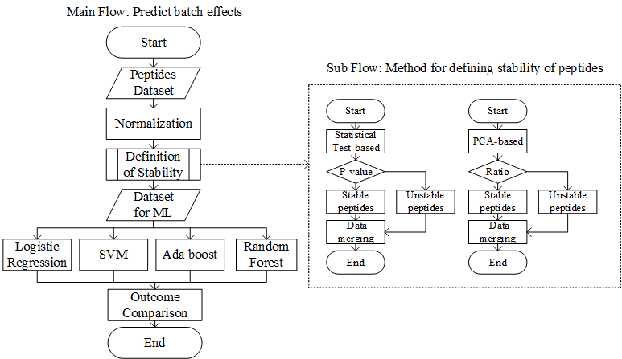

# Course Project: Identifying batch effect susceptible peptides in proteomics using machine learning

Using machine learning algorithms to better understand how batch effects impact peptides with different characteristics. Best case, this could be used to identify how reliable peptides are for batch effects, and thus whether they are suitable as biomarkers or not.

# Structure Describe

Original Data is stored in ```..\BatchEffect\data\original_data```. The name format is ```XXX.tsv```and ```XXX_design.tsv```

This project is accomplished by python and R, and the scripts are saved in 

```\BatchEffect\scripts\jupyter``` and ```\BatchEffect\scripts\R``` respectively.

And some common used functions are in ``\BatceEffect\pyLib\cx_lib.py``

# Working Flow



1. Normalization with ```..\BatchEffect\scripts\R\evaluation.R```.

   ```R
   jobName <- 'hela'
   outDir <- '../../data/original_data'
   dataFp <- '../../data/original_data/hela.tsv'
   designFp <- '../../data/original_data/hela_design.tsv'
   ```

   The normalized data will be output to ```../../data/original_data/hela```

2. Analyzing work is using ```\BatchEffect\scripts\jupyter\xxxx_workFlow.ipynb```.

3. Statistical test on normalized data with ```..\BatchEffect\scripts\R\statisc.R```.

   ```R
   outDir <- "../../data/original_data"
   designFp <- "../../data/original_data/hela_design.tsv"
   dataFp <- "../../data/original_data/hela.tsv"
   
   normMatrixPath <- paste(outDir, "../../data/original_data/hela/RT-VSN-normalized.txt", sep="/")
   ```

   Job name is hela. Normalization method should be selected, here the RT-VSN-normalized will be used.

   The output file are named as ```'../../data/original_data/xxx/xxx_stats.csv'```

4. Adding feature is completed by ```../BatchEffect/scripts/R/peptides.R```.

   ```R
   batch_info = read.csv('../../data/original_data/hela/hela_data.csv')
   ```

   Selected peptides for further study are named as ```'../../data/original_data/xxx/xxx_data.csv'```

   The peptides with features are named as ```'../../data/original_data/xxx/xxx_trainSet.csv'```

# Result

|                          | Accuracy on Train Set | Accuracy on Test Set | Accuracy on Train Set | Accuracy on Test Set |
| :----------------------: | --------------------- | -------------------- | --------------------- | -------------------- |
|                          | Plasma Data Set       | Hela Data Set        | Plasma Data Set       | Hela Data Set        |
|   Logistic Regression    | 0.7374                | 0.6371               | 0.7632                | 0.6156               |
|  Support Vector Machine  | 0.7567                | 0.6251               | 0.7632                | 0.6031               |
| Random Forest Classifier | 0.7644                | 0.598                | 0.749                 | 0.6089               |
|   AdaBoost Classifier    | 0.6427                | 0.5794               | 0.7193                | 0.5531               |

